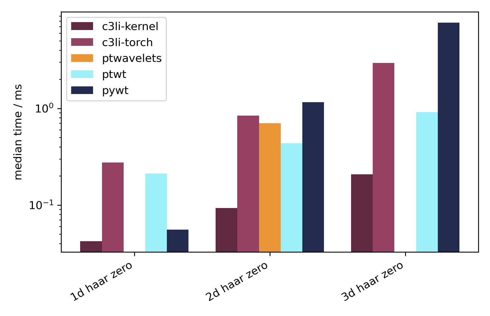
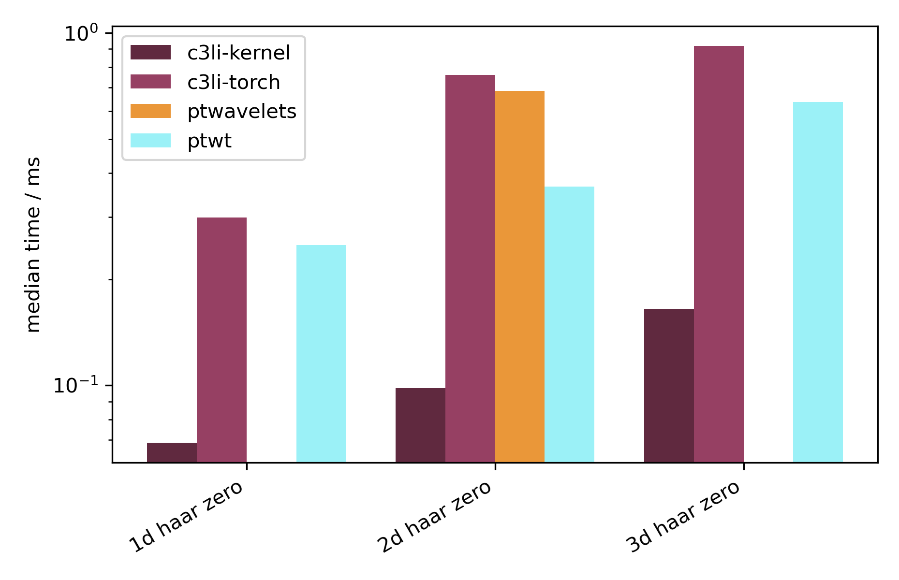
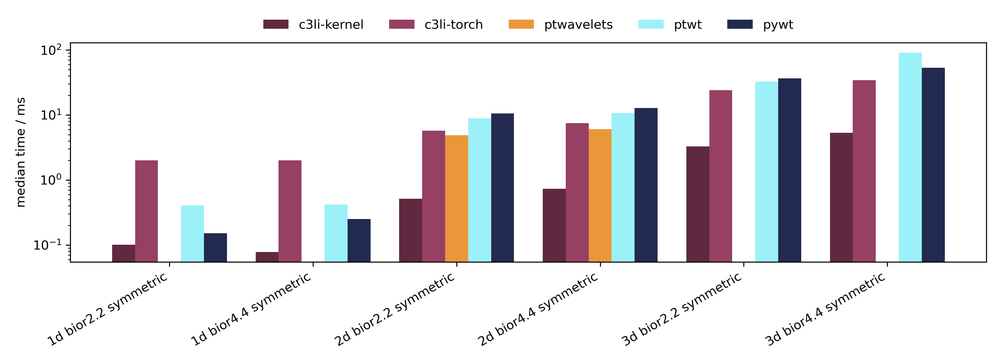
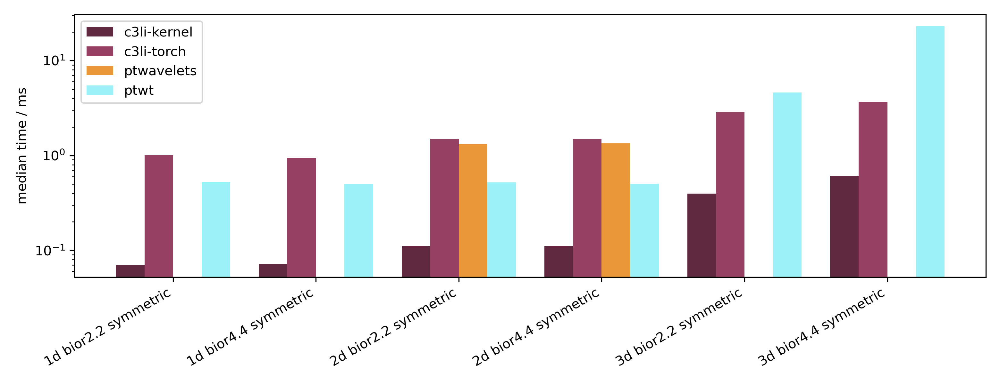
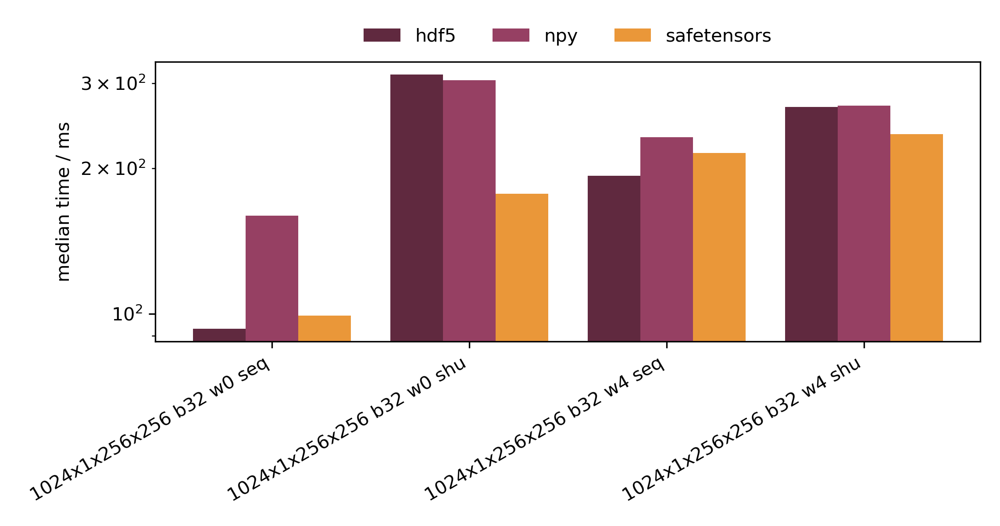
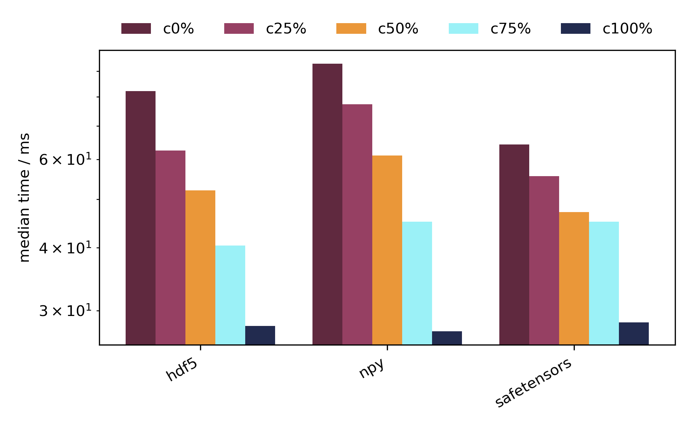

# Benchmarks

Every script under `benches/` is built on `chuchichaestli.benchmark`, so they
share a command line and a way of reporting, and one section here covers each
of them. The external libraries are not dependencies; pull them in for the run
with `--with`.

Common to all: a backend is checked against a reference before it is timed, so
a fast wrong answer cannot win; `--threads` pins the torch intra-op count and
`--device` chooses where to run; `--repeats N` measures in that many fresh
processes and reports the median with the spread across them; `--json` saves
the results and `--from-json` reports or plots saved ones without measuring
again.


## Discrete wavelet transform { #dwt }

`benches/dwt_impl.py` times the native kernels against the pure-torch path,
and external libraries, always checking each against a reference before timing
it.


### Measuring { #dwt-measuring }

Measure once and keep the json, one run per workload per device:

=== "LiteVAE, CPU"

    ```bash
    taskset -c 0-15 \
      uv run --with pywavelets --with ptwt --with pytorch_wavelets \
        python benches/dwt_impl.py \
          --device cpu \
          --threads 1 \
          --dims 1 2 3 \
          --sizes 4096 256x256 64x64x64 \
          --wavelets haar \
          --modes zero \
          --levels 3 \
          --repeats 5 \
          --json litevae-cpu.json
    ```

=== "LiteVAE, GPU"

    ```bash
    uv run --with ptwt --with pytorch_wavelets \
      python benches/dwt_impl.py \
        --device cuda \
        --backends c3li-torch c3li-kernel ptwt ptwavelets \
        --dims 1 2 3 \
        --sizes 4096 256x256 64x64x64 \
        --wavelets haar \
        --modes zero \
        --levels 3 \
        --repeats 5 \
        --json litevae-cuda.json
    ```

=== "JPEG 2000, CPU"

    ```bash
    taskset -c 0-15 \
      uv run --with pywavelets --with ptwt --with pytorch_wavelets \
        python benches/dwt_impl.py \
          --device cpu \
          --threads 1 \
          --dims 1 2 3 \
          --sizes 16384 512x512 96x96x96 \
          --wavelets bior2.2 bior4.4 \
          --modes symmetric \
          --levels 3 \
          --repeats 5 \
          --json jpeg2000-cpu.json
    ```

=== "JPEG 2000, GPU"

    ```bash
    uv run --with ptwt --with pytorch_wavelets \
      python benches/dwt_impl.py \
        --device cuda \
        --backends c3li-torch c3li-kernel ptwt ptwavelets \
        --dims 1 2 3 \
        --sizes 16384 512x512 96x96x96 \
        --wavelets bior2.2 bior4.4 \
        --modes symmetric \
        --levels 3 \
        --repeats 5 \
        --json jpeg2000-cuda.json
    ```

LiteVAE uses the Haar transform, three levels, recursed on the approximation
band. JPEG 2000 uses the LeGall 5/3 and CDF 9/7 biorthogonal pair under
symmetric extension. The sizes follow from how deep each can go: 9/7 caps at
two levels on a 64-long axis, so the volumetric case is 96 cubed.


### Reporting { #dwt-reporting }

`--from-json` loads saved results and reports or plots them without
re-measuring anything. Several files are merged, so a sweep split one backend
per process is drawn as one figure:

```bash
python benches/dwt_impl.py \
  --from-json \
      docs/assets/litevae-cpu-amd-gfx1151.json \
	  docs/assets/jpeg2000-cpu-amd-gfx1151.json \
  --plot dwt-cpu-amd-gfx1151.png
```

Printing gives the same tables a live run does, one per device and thread
count, since every row carries the label and thread count it was measured
under. A plot has no such axis, so draw one device at a time.


### Results { #dwt-results }

Forward transform, `float32`, three levels, batch `2x1`, median of five runs
in fresh processes. The CPU runs are pinned to one thread, which is the honest
comparison against PyWavelets; the GPU runs are on an AMD gfx1151 under ROCm 
7.2 (PyWavelets is missing because it cannot run on GPUs).

<div class="grid" markdown>

<figure markdown="span">
  
  <figcaption>LiteVAE &mdash; Haar, CPU (at one thread)</figcaption>
</figure>

<figure markdown="span">
  
  <figcaption>LiteVAE &mdash; Haar, GPU</figcaption>
</figure>

<figure markdown="span">
  
  <figcaption>JPEG 2000 &mdash; 5/3 and 9/7, CPU (at one thread)</figcaption>
</figure>

<figure markdown="span">
  
  <figcaption>JPEG 2000 &mdash; 5/3 and 9/7, GPU</figcaption>
</figure>

</div>


### Profiling { #dwt-profiling }

`--profile` attributes the time to operators, so the compiled kernels appear by
name next to the ATen internals. `--trace DIR` additionally writes a Chrome
trace per case, providing a richer profiling interface.

```bash
python benches/dwt_impl.py \
  --device cuda --backends c3li-kernel \
  --dims 2 --sizes 1024x1024 --wavelets haar --modes zero --levels 3 \
  --profile --trace traces/
```

Open the result at [ui.perfetto.dev](https://ui.perfetto.dev), or look at
[this one](https://ui.perfetto.dev/#!/?url=https://caiivs.github.io/chuchichaestli/assets/dwt-trace-litevae-cuda-amd-gfx1151.json){ target=_blank }, from the command above. It shows the LiteVAE path: one
`c3li::haar_wavedec` per call wrapping three `c3li::haar_nd` launches, one per
level, since the fused Haar kernel does both axes at once. Search for
`haar_nd` to inspect them.

The traces carry profiling overhead (on ROCm roughly twice the measured time),
so read them for structure and the tables/plots above for timings.


## Dataset reading { #data }

Two benchmarks read the very same samples off disk, written once per format
under `--data-dir` and reused. `benches/dataset_types.py` times what a first
epoch costs, dropping the files from the page cache before every run so the
reads go to storage; `benches/dataset_caching.py` times the epochs after that
(sto-caching), with a share of the samples held in shared memory. Keep that
directory on real storage: nothing on `tmpfs` can be dropped from the page
cache, and a sweep there measures reads served from memory.


### Measuring { #data-measuring }

=== "Formats, first epoch"

    ```bash
    python benches/dataset_types.py \
      --samples 1024 \
      --sizes 1x256x256 \
      --batch-size 32 \
      --workers 0 4 \
      --repeats 3 \
      --json dataset_types_1024x1x256x256_b32.json
    ```

=== "Sample cache, later epochs"

    ```bash
    python benches/dataset_caching.py \
      --samples 1024 \
      --sizes 1x256x256 \
      --batch-size 8 \
      --fractions 0 0.25 0.5 0.75 1 \
      --json dataset_caching_1024x1x256x256_b8_w0_shu.json
    ```

Both sweep the sizes, sample counts, batch sizes, worker counts and orders
they are given. The caching sweep reads shuffled in the main process by
default, since that is where a partial cache shows: a shuffled loader draws
uniformly, so the hit rate is the share cached.


### Results { #data-results }

A 256 MiB dataset &mdash; 1024 samples of `1x256x256` `float32` &mdash; read on
the CPU, the first epoch as the median of three runs in fresh processes.

<div class="grid" markdown>

<figure markdown="span">
  
  <figcaption>First epoch &mdash; cold reads, batch 32</figcaption>
</figure>

<figure markdown="span">
  
  <figcaption>Later epochs &mdash; shuffled, batch 8</figcaption>
</figure>

</div>

Which format wins depends on the order the loader draws in: HDF5 reads front to
back fastest, at 93 ms against 160 ms for `.npy`, and safetensors shuffled, at
177 ms against 312 ms. Cached in full they converge on 28 ms, since a cached
epoch is read out of the same shared memory whatever wrote the file.
